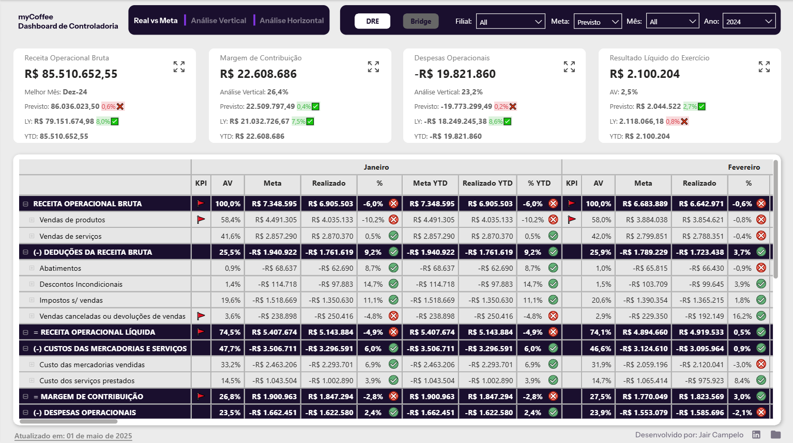

# Projeto de Dashboard de Controladoria - DRE

## Contexto Geral

Nesse repositório apresento um projeto de elaboração de um painel de Controladoria, voltado para o uso da Diretoria de uma empresa fictícia chamada **myCoffee**, onde é possível realizar:

- Análises temporais: comparando YoY, meses onde a Meta (Previsto, Orçado) foi batida
- Análise Vertical: comparando as deduções vs Receita Operacional Bruta
- Análise Bridge: Maneira mais visual de analisar as deduções da Receita Bruta

Também foram aplicados conceitos de **Data Storytelling**, criando medidas para títulos dinâmicos e melhorias de UX para identificar com mais facilidade reusltados positivos ou negativos.

## Dashboard de Controladoria

## Mapeamento de Requisitos

Antes da construção do relatório, foi realizado um [Mapeamento de Requisitos](https://www.notion.so/Metodologia-ESI-myCoffee-2aee6f6c37ef801c9b6cde0d02b1ce9f?source=copy_link) utilizando a Metodolodia ESI no Notion, que aborda conceitos de Entendimento, Solução e Implantação de um projeto de BI.

## Tecnologias Utilizadas

- Power BI
- Figma
- Power Query
- Notion